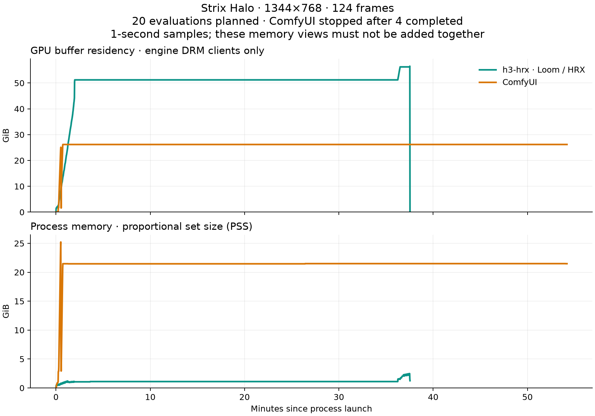

# Strix Halo 768p comparison — 2026-09-13

This comparison increases the [480p workload](../20260913/README.md) to
**1344×768**, retaining 124 frames at 24 fps, a 20-evaluation schedule, the same
[floating-glacier prompt](../../prompts/floating_glacier.txt), and seed 1618.
Both engines use the same Comfy-Org int8 ConvRot checkpoints in the standard
Hugging Face Hub cache. h3 uses int8 products and default int8 QK attention;
ComfyUI uses bf16 compute on those quantized weights.

The engines run sequentially on AMD Strix Halo (`gfx1151`), with 128 GB unified
memory. Versions, checkpoint hashes, and the shared encoder are recorded in
[environment.json](environment.json). Model downloads are excluded. Runtime and
kernel caches are not cleared between runs.

## Results

**37 min 33 s with h3, roughly 4 h 20 min with ComfyUI** for a 124-frame clip at
20 evaluations: about **6.9× faster overall**, with **7.48× faster steady denoising**.

| Measurement | h3-hrx (Loom / HRX) | ComfyUI |
| --- | ---: | ---: |
| Completed evaluations | 20 | 4 |
| Steady observations, excluding the first | 19 | 3 |
| Steady median per evaluation | **103.2 s** | 772.422 s |
| Steady evaluation range | 99.8–103.4 s | 770.778–775.567 s |
| Sampled peak GPU-resident buffers | 56.51 GiB | 26.19 GiB |
| Sampled peak process PSS | 2.48 GiB | 25.23 GiB |
| Memory observation scope | Full generation | Loading and sampling only |

ComfyUI was intentionally stopped during evaluation five after four evaluations
had completed. Its three post-warmup intervals are enough to report the observed
steady denoising difference, but not independent repetitions or a statistical
significance result. **ComfyUI did not decode or export the clip.** Its memory
measurements are not full-pipeline peaks. The full ComfyUI time is extrapolated below.
The recorded exit 137 comes from the intentional container stop, not an OOM.

h3 completed all 20 evaluations in 2056.4 seconds of sampling, decoded in 77.2
seconds, and wrote MP4/WAV output in **2253.0 seconds (37 min 33 s)** from launch.
The MP4 contains 124 frames at 1344×768 and non-silent stereo AAC audio. The
suspended glacier, waterfalls, and moving boat remain coherent across sampled frames.

[](../../media/benchmarks/20260913-768p/h3.mp4)

[Raw logs and telemetry](raw/) · [Machine-readable results](results.json)



Each curve begins at its own process launch; the engines ran sequentially.
h3's curve covers its completed output pipeline. ComfyUI's curve ends after an
intentional stop during sampling, including the partial fifth evaluation. Curve
lengths therefore do not compare times to finished clips.

## End-to-end timing

ComfyUI takes **roughly 4 h 20 min** for this workload, based on its observed
768p sampling rate and the earlier run's loading and decoding overhead. Compared
with h3's measured **37 min 33 s**, that is **about 6.9× faster overall**.

The [September 6 measurement in Git history](https://github.com/zacharydenton/h3-hrx/blob/52827db9f05ca0b6012dfeb05f535abc0d4f9c81/docs/notes.md#head-to-head-with-comfyui-at-768-2026-09-06)
recorded ComfyUI evaluations of 772.7, 772.4, and 768.8 seconds at the same
1344×768 / 124-frame shape, using the same ComfyUI revision and bf16 compute.
That run used Euler and a different prompt, without decoding; it corroborates
the current 772.422-second median.

The [earlier 480p metrics](https://github.com/zacharydenton/h3-hrx/blob/416a3c4c6a5fe0ee20fcad60c18e35c027692aaf/docs/benchmarks/20260913/raw/comfy_floating_glacier/metrics.json)
recorded 50.151 seconds for video/audio decoding and saving. Subtracting sampling
and decode/save from its 1806.075-second process time leaves 44.001 seconds for
conditioning, loading, and other process overhead. The estimate keeps that
overhead, scales decode/save by the spatial area ratio (2.489×), and allows five
seconds for MP4 encoding, which the earlier container could not complete.

| Component | ComfyUI seconds |
| --- | ---: |
| Sampling: 20 × current steady median | 15,448.4 |
| Decode/save: prior 480p time × spatial area ratio | 124.8 |
| Other process overhead from the prior run | 44.0 |
| Assumed MP4 encoding allowance | 5.0 |
| Total | **15,622.3 (about 4 h 20 min)** |

This extrapolates a full clip; the observed ComfyUI process ended after 3252.3
seconds during evaluation five. Decode scaling and encoding are assumptions,
but sampling accounts for 98.9% of the total. Even doubling the projected
decode/save time changes the total by only about two minutes.
[Reproducible calculation](estimate_e2e.py) · [Inputs and result](e2e_estimate.json).

## Method

Steady denoising excludes the first evaluation and reports the median and range
of completed evaluations 2–20 for h3 and 2–4 for ComfyUI. The sample counts
differ. One trajectory per engine is not a set of independent repetitions. The engines' random streams and arithmetic differ, so equal seeds
do not imply identical output images or equal perceptual quality.

Memory is sampled once per second across the observed process lifetime. GPU
residency counts the engine's AMD DRM clients' resident GTT and VRAM buffers,
deduplicating shared client IDs. Process PSS covers the engine and its children,
including ComfyUI's host PID inside Podman. These are overlapping views of
unified memory and **must not be added together**. Sampling may miss brief peaks.
System RAM and swap counters include other applications.

The wrapper requires 30 seconds of GPU idleness and at least 80 GiB available
RAM before starting each engine. If available RAM falls below 12 GiB, it stops
its own workload. The guards do not reserve memory against other applications.

Both engines use the exact same FFmpeg 7.0.2 binary, with H.264 CRF 18, YUV420p,
AAC at 192 kb/s, and 24 fps as the intended output settings. h3 generated MP4
and PCM WAV; ComfyUI was stopped before decoding or output. Its final NPY exports
were disabled. The host and container both passed a 768p video/audio
encoding check before inference. This addresses the missing `libx264` encoder
in the earlier 480p ComfyUI run.

## Reproduce

Build `h3`, populate the standard HF cache, and provision the recorded ComfyUI
image from [environment.json](environment.json). The pinned
[imageio-ffmpeg](https://github.com/imageio/imageio-ffmpeg) wheel supplies a shared
FFmpeg executable for both environments; this is benchmark provisioning, not
an h3 runtime Python dependency.

```sh
cargo build --locked --release --bin h3
python3 -m venv build/benchmark-768p/tools-venv
build/benchmark-768p/tools-venv/bin/pip install imageio-ffmpeg==0.6.0
mkdir -p build/benchmark-768p/bin
build/benchmark-768p/tools-venv/bin/python - <<'PY'
from pathlib import Path
import hashlib
import imageio_ffmpeg
exe = Path(imageio_ffmpeg.get_ffmpeg_exe()).resolve()
assert hashlib.sha256(exe.read_bytes()).hexdigest() == 'e7e7fb30477f717e6f55f9180a70386c62677ef8a4d4d1a5d948f4098aa3eb99'
Path('build/benchmark-768p/bin/ffmpeg').symlink_to(exe)
PY
python3 docs/benchmarks/20260913-768p/run_pair.py
```

The runner refuses to overwrite existing run logs. It records the exact command
arguments, and does not start ComfyUI if h3 fails. `h3 --steps 21` and ComfyUI's
`--steps 20` both produce 20 evaluations.

This command schedules full runs. The recorded ComfyUI run was stopped with
`podman stop --time 10 h3-benchmark-768p-20260913` after evaluation four; Podman
used SIGKILL after the graceful-stop timeout. Do not substitute a four-evaluation
schedule: that would change the sigma grid, rather than observe the beginning of
the same 20-evaluation workload.

To regenerate the checked-in analysis without another GPU run:

```sh
python3 docs/benchmarks/20260913/summarize.py docs/benchmarks/20260913-768p/raw \
  --case floating_glacier_768p --sampling-only
python3 docs/benchmarks/20260913-768p/estimate_e2e.py
python3 docs/benchmarks/20260913/plot_memory.py docs/benchmarks/20260913-768p/raw \
  --case floating_glacier_768p --out docs/benchmarks/20260913-768p/memory.png
```

`--sampling-only` permits an intentional early stop and omits any end-to-end
speedup. It still requires consecutive completed evaluation records and rejects
runs aborted by the memory-pressure guard. Plotting requires Matplotlib.
