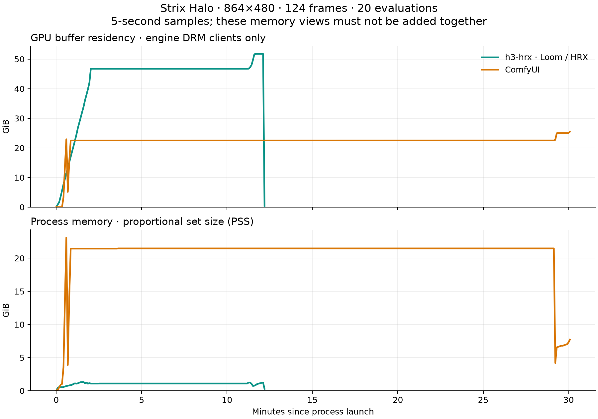

# Strix Halo comparison — 2026-09-13

This benchmark compares h3-hrx and ComfyUI using the same Comfy-Org int8 ConvRot
checkpoints, prompt, dimensions, frame count, sampler, and number of evaluations.
The source versions and container image digest are recorded in [environment.json](environment.json).
The comparison includes [raw logs and telemetry](raw/), a
[machine-readable summary](results.json), and the memory timeline below.

## Results

| Measurement | h3-hrx (Loom / HRX) | ComfyUI |
| --- | ---: | ---: |
| Steady median, evaluations 2–20 | 28.1 s | 85.541 s |
| Steady evaluation range | 26.8–28.2 s | 84.487–86.398 s |
| All 20 evaluations, sampling time | 554.4 s | 1711.9 s |
| Sampled peak GPU-resident buffers | 51.74 GiB | 25.45 GiB |
| Sampled peak process PSS | 1.32 GiB | 23.12 GiB |

**3.04× faster steady denoising**, with about **2.03× the GPU-resident buffers**.
PSS and GPU-resident bytes are overlapping views and must not be summed.

h3 completed MP4/WAV output in 731.7 seconds. ComfyUI completed all 20 evaluations
and decoded 124 video frames plus stereo audio, then failed to encode MP4 because
its container's FFmpeg lacks `libx264`. Its 1806.1-second process duration ends in
that failure, so it is **not a comparable time to finished output**. No end-to-end
speedup is reported. The later encoding failure does not invalidate the completed
sampling intervals or the memory samples collected through inference and decoding.



Each curve starts at its own process launch; the engines ran sequentially.
The curves include the observed output stage (successful export for h3, a failed
encoding attempt for ComfyUI). PSS is not total device memory: ComfyUI's reported
PyTorch allocator peaks are also incomplete views of its DRM buffer allocations.

## Workload

- AMD Strix Halo (`gfx1151`), Ryzen AI Max+ 395, 128 GB unified RAM.
- 864×480, 124 frames at 24 fps (5.17 seconds), text-to-video with audio.
- [Floating glacier prompt](../../prompts/floating_glacier.txt), seed 1618.
- `res_multistep`, `simple` schedule, 20 evaluations, CFG 1.
- h3 uses default int8 QK attention and int8 weight products. ComfyUI uses its
  default BF16 PyTorch attention, BF16 activations, and quantized linear kernels
  on the same checkpoints. BF16 inference dtype does not imply BF16 arithmetic
  for every matrix product.
- Model downloads are excluded. The engines run sequentially; no second GPU
  computation is intentionally run alongside them.

The same numeric seed does not guarantee identical initial noise across engines.
Their arithmetic also differs. This is a performance comparison of the same
workload, not a test of identical output pixels or equal perceptual quality.

## Timing boundaries

The steady denoising measurement excludes each engine's first evaluation, which
can include loading, compilation, and other initialization. h3 prints cumulative
sampling time rounded to 0.1 seconds; differences recover individual evaluation
times. ComfyUI synchronizes the GPU at each sampler callback and records intervals.
The small sampler update falls on opposite sides of the two callbacks.

Each engine contributes one complete sampling trajectory and decode. Evaluations within a run are correlated;
they are not independent repeated runs, and no statistical-significance claim is
made. Report the median and range to describe the observed practical difference.

The wrapper records process launch through exit, including loading, text encoding,
sampling, decoding, and output handling. Checkpoints are already cached, and
runtime/kernel cache histories are not reset. The planned output settings were
H.264, CRF 18, YUV420p, AAC at 192 kb/s, and 24 fps, with ComfyUI's final NPY
exports disabled. Only h3 completed that MP4 output; see the encoder failure above.
The steady denoising result is the speed comparison.
Both measured engines read the same verified checkpoint blobs from the local HF
cache. An earlier whale showcase render used cache links to USB storage; that
initial run is excluded from this paired comparison. The desert-ocean showcase
run overlapped another GPU application during its initial two evaluations and is
also excluded. That overlap exhausted RAM and swap and triggered the kernel OOM
killer. The fresh glacier run is the paired case; it began with 86 GiB available.

## Memory

The wrapper samples memory every five seconds throughout loading, text encoding,
denoising, decoding, and output writing. Report these as **sampled peaks**: a
short-lived allocation between samples can be missed.

- **GPU resident memory:** the engine's AMD DRM clients, counting resident GTT and
  VRAM bytes once per client, following the [Linux DRM accounting definitions](https://docs.kernel.org/gpu/drm-usage-stats.html#memory). This includes buffers outside a framework allocator.
- **Process PSS:** proportional resident process memory from `/proc/PID/smaps_rollup`,
  summed across the engine and its children. Shared pages are proportionally counted; see the [Linux `/proc` documentation](https://docs.kernel.org/filesystems/proc.html).
- **System pressure:** available system memory and swap usage, including background
  applications. These are context, not the engine's exclusive memory footprint.

Process PSS and GPU memory are different views of unified memory and must not be
added together. Unrelated DRM clients are excluded from each engine's accounting;
this matters because background GPU applications were present during the excluded
pilot runs. The container
host PID is obtained with `podman inspect` so ComfyUI's memory is measured directly,
not just the Podman launcher.

System context for these sequential runs (includes other applications):

| System counter | h3-hrx run | ComfyUI run |
| --- | ---: | ---: |
| Available RAM before launch | 86.02 GiB | 87.12 GiB |
| Lowest available RAM | 34.06 GiB | 41.58 GiB |
| Swap used before launch | 36.25 GiB | 36.60 GiB |
| Highest swap used | 36.60 GiB | 36.72 GiB |

The pre-existing swapped pages are not attributed to either engine.

## Reproduce

Build the checkout's release binary. The timing wrapper uses the GPU sensors under
`/sys/class/drm/card1/device` on this machine and waits for 30 seconds below 10%
GPU utilization and at least 70 GiB available system memory. The wrapper stops
its own workload if available memory falls below 8 GiB. These guards do not reserve
RAM against allocations by other applications. Use `--gpu-device /sys/class/drm/cardN/device` to select another GPU.
It records wall time, command arguments, GPU activity, temperature, and processes
holding `/dev/kfd`. A process holding that device is not necessarily doing GPU work.

```sh
cargo build --locked --release --bin h3
python3 docs/benchmarks/20260913/run_timed.py \
  --out-dir build/showcase-20260913 --name floating_glacier \
  --stdin docs/prompts/floating_glacier.txt -- \
  env HF_HUB_OFFLINE=1 HRX_OFFLINE=1 target/release/h3 \
  --width 864 --height 480 --frames 124 --steps 21 --seed 1618 \
  --out build/showcase-20260913/floating_glacier.mp4
```

For ComfyUI, use the recorded image digest instead of relying on the mutable `latest`
tag. The image includes its ComfyUI checkout and ROCm PyTorch. Mount the shared
HF cache read-only, with the existing checkpoints already downloaded. The measured
image lacks `libx264`; the script now checks the encoder before loading models.
For a new run with `--video-out`, supply an FFmpeg build with libx264 and AAC in
the container and record that environment change. To run the image as-is, omit
`--video-out` for its original NPY/WAV exports, and do not compare those wall times
to h3's MP4 export. The following records the original measured command:

```sh
python3 docs/benchmarks/20260913/run_timed.py \
  --out-dir build/showcase-20260913 --name comfy_floating_glacier \
  --container h3-showcase-comfy-20260913 -- \
  podman run --rm --name h3-showcase-comfy-20260913 --device /dev/kfd --device /dev/dri \
  --group-add keep-groups --security-opt label=disable \
  -v "$PWD:$PWD" \
  -v "$HOME/.cache/huggingface/hub:$HOME/.cache/huggingface/hub:ro" \
  -w "$PWD" -e HF_HUB_CACHE="$HOME/.cache/huggingface/hub" -e HF_HUB_OFFLINE=1 \
  --entrypoint /opt/venv/bin/python \
  docker.io/kyuz0/amd-strix-halo-comfyui@sha256:384aa1fecef6a841832e0d5552949977330308d8c25e212a94f5e8dfcc061cae \
  scripts/comfy_dump.py --comfy /opt/ComfyUI --prompt-file docs/prompts/floating_glacier.txt \
  --width 864 --height 480 --length 124 --steps 20 --seed 1618 \
  --out build/showcase-20260913/comfy_floating_glacier \
  --video-out build/showcase-20260913/comfy_floating_glacier/video.mp4

python3 docs/benchmarks/20260913/summarize.py docs/benchmarks/20260913/raw --inference-only
```

`h3 --steps 21` means 21 sigma grid points and 20 evaluations. ComfyUI's
`--steps 20` means 20 evaluations directly. Do not pass the same number to both
options when comparing work.

`--inference-only` permits the documented post-decode encoder failure and omits
any end-to-end speedup. The summary still rejects incomplete evaluation sequences.
The checked-in script adds the encoder preflight after this run; no timed GPU
code was changed. To regenerate the plot:

```sh
python3 docs/benchmarks/20260913/plot_memory.py docs/benchmarks/20260913/raw \
  --out docs/benchmarks/20260913/memory.png
```

The plotting script requires Matplotlib; the timing and summary scripts use the
Python standard library. The reference runner uses ComfyUI's environment.
