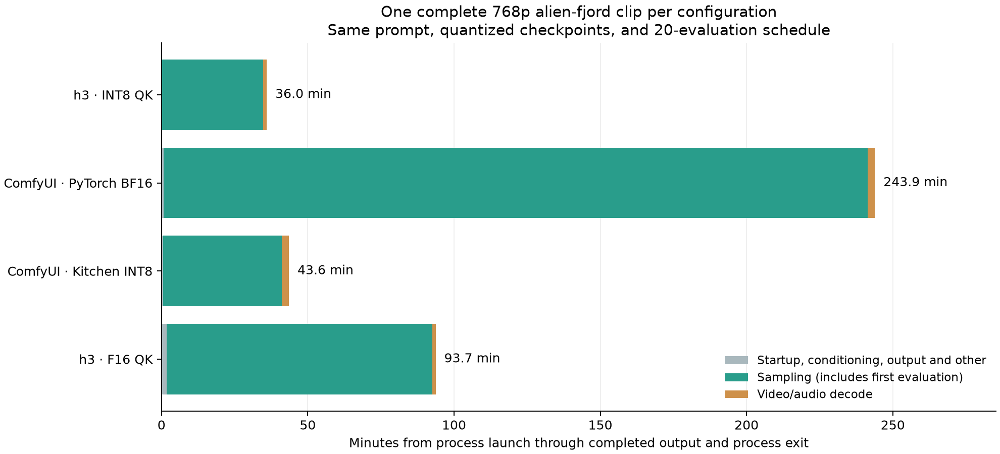
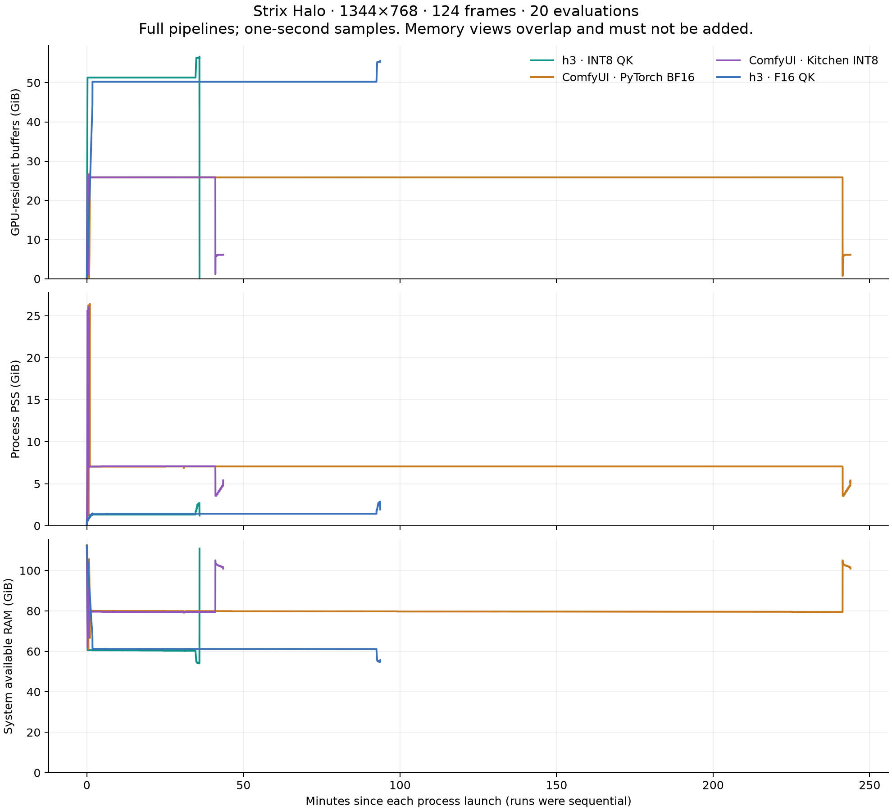

# Native Strix Halo 768p evaluation — 2026-09-14

This evaluation runs h3-hrx and an updated, native ComfyUI installation through
complete video and audio generation. It includes ComfyUI's default PyTorch
attention and its built-in Comfy Kitchen INT8 attention backend. The latter is
selectable through the **Model Attention Backend** node; it needs no custom node
or source patch.

h3 completed in **35 min 59 s**, versus **4 h 3 min 53 s** for default ComfyUI:
**6.78× faster end to end** on this workload. Both processes completed all 20
evaluations, video/audio decoding, and MP4/WAV output. With built-in **Comfy
Kitchen INT8 attention**, ComfyUI finishes in **43 min 33 s**, reducing h3's
advantage to **1.21×** (7 min 35 s saved). h3 with F16 QK attention takes
**1 h 33 min 43 s**, or 2.60× the default h3 time.

| Completed configuration | Full process time | Steady median/evaluation | Decode and output preparation |
| --- | ---: | ---: | ---: |
| h3 default | **35 min 59 s** | **103.9 s** | **75.2 s** |
| ComfyUI default | 4 h 3 min 53 s | 721.3 s | 148.0 s |
| ComfyUI Kitchen | 43 min 33 s | 121.7 s | 147.5 s |
| h3 F16 | 1 h 33 min 43 s | 272.6 s | 73.0 s |



[Machine-readable results](results.json) · [h3 video](../../media/benchmarks/20260914/h3-i8.mp4) ·
[ComfyUI default video](../../media/benchmarks/20260914/comfy-pytorch.mp4) ·
[ComfyUI Kitchen video](../../media/benchmarks/20260914/comfy-kitchen.mp4) ·
[h3 F16 video](../../media/benchmarks/20260914/h3-f16.mp4)

## Workload

The main comparison uses the [alien-fjord prompt](../../prompts/alien_fjord.txt),
seed 1618, **1344×768**, **124 frames at 24 fps**, and **20 evaluations** with
`res_multistep`, the `simple` schedule, and CFG 1. All configurations use the same
Comfy-Org INT8 ConvRot diffusion and text-encoder checkpoints, plus the same
video and audio VAEs, directly from the standard Hugging Face Hub cache.

| Configuration | Diffusion attention | Diffusion weight products |
| --- | --- | --- |
| h3 default | Rotated INT8 QK, F16 PV | INT8 |
| ComfyUI default | PyTorch BF16 | Comfy Kitchen INT8, BF16 outputs |
| ComfyUI Kitchen | Comfy Kitchen INT8 attention | Same as ComfyUI default |
| h3 F16 | F16 QK, F16 PV | Same as h3 default |

h3's F16 option also changes the attention kernel and operand layout. At this
sequence length, the default INT8 path packs Q/K by head and uses a 64-key tile;
the F16 path uses the older MHA kernel family. Their timing difference therefore
describes these implementations, not the inherent cost of the two data types.
The dispatch selection is in [`Stack`](../../../src/stack.rs).

The attention overrides affect only the diffusion model. Text encoding and VAE
decoding keep each engine's normal implementation. h3's `--steps 21` specifies
21 sigma grid points and therefore 20 evaluations; ComfyUI's `--steps 20`
specifies 20 evaluations directly. Step caching is disabled.

Current ComfyUI uses its quantized linear path for these INT8 ConvRot weights.
The checkpoint metadata does not request full-precision matrix multiplication;
ComfyUI enables INT8 compute on this device, and Comfy Kitchen dispatches the
weight-only layout through activation rotation/quantization and an INT8 GEMM.
The model's reported `torch.bfloat16` inference dtype describes its floating
activations, not the arithmetic of every matrix product. The older archived
ComfyUI profile also records INT8 linear kernels; earlier report wording that
described its entire weight-compute path as BF16 was too broad. The important
comparison is the complete implementations, including their attention kernels.

Both engines use the same system FFmpeg, H.264 video and AAC audio, with no
upscaling or frame interpolation. End-to-end time runs from process launch to
process exit after successful output, including conditioning, loading, sampling,
decoding, encoding, and diagnostic latent-file writes. Downloads are excluded;
cached checkpoints and existing kernel/runtime caches are reused. Caches are
not flushed between configurations; any first-use compilation remains inside
the measured process time. These are fresh processes, rather than repeated requests
inside a permanently loaded service. Filesystem caches were not forced into an
identical resident state: h3 preparation varied from 11.0 to 107.7 seconds across
these full runs, including the same prompt's F16 control. That variation limits
conclusions about startup savings; the steady sampling medians exclude it.

All runs are sequential on the same 128 GB Strix Halo machine. There is one
complete trajectory per configuration, not a set of independent repetitions.
Steady-step statistics omit evaluation one, which can include lazy weight
materialization and other first-use work. Intrusive profiling runs use only two
evaluations at the full 768p shape and are excluded from speedup calculations.

## Quality comparison

The [local comparison player](compare.html) synchronizes playback and lets you
choose any pair of attention configurations. Open it from a complete checkout.

Equal integer seeds do not produce the same noise in h3 and ComfyUI: their random
number generators differ. The two h3 variants share one random sequence; the two
ComfyUI variants share another. Within-engine comparisons therefore isolate the
attention change more directly. Cross-engine clips show different compositions,
so their pixel difference is not a quality score.

[check_outputs.py](check_outputs.py) checks finite final latents, WAV levels,
identical saved ComfyUI noise arrays, and differences between each engine's
attention variants. Latent cosine and relative error describe numerical
divergence; they do not score perceptual quality. The input hashes are recorded
with the results. Recomputing these checks requires the original latent and WAV
outputs from the benchmark queue.

The two completed ComfyUI variants have exactly identical saved initial video
and audio noise. Their final video latent cosine is **0.95353** (relative L2
**0.30527**); audio cosine is **0.99386**. Sampled frames preserve the same fjord,
boat, and translucent alien composition, with visible differences in its eyes,
membranes, and internal detail. This is a review of one prompt, not a general
quality-equivalence claim. Both produce finite latents and valid stereo sound,
with no near-full-scale PCM samples in the exported WAVs.

The h3 INT8/F16 pair uses the same deterministic random sequence. Its final
video latent cosine is **0.94250** (relative L2 **0.33933**); audio cosine is
**0.99766**. Sampled frames retain the same armored creature, boat, and fjord,
with different plate detail and flowing appendages. Both remain somewhat glossy;
F16 does not show an obvious perceptual improvement on this one prompt despite
its 2.60× full-process cost. This judgment is limited to the reviewed frames and
is not a general quality-equivalence result.

[quality.json](quality.json) contains the numeric checks, audio levels, and file
hashes. All six full text-to-video outputs have finite final video/audio latents
and valid stereo WAVs without near-full-scale PCM samples.

### Additional 768p scenes

[Tidal Sky](../../media/showcase/tidal-sky.mp4) took **36 min 52 s**. Its sampled
frames preserve the fisherman, boat, fjord, suspended water, and many-finned alien
as the creature passes overhead. The [showcase](../../showcase.md#tidal-sky--768p)
includes the prompt and command.

[Midnight Tram](../../media/showcase/midnight-tram.mp4) took **37 min 29 s** and
produces convincing wet cobblestones, window light, reflections, and a passing
tram. It does **not clearly achieve the requested two-meter levitation** in the
[prompt](../../prompts/midnight_tram.txt). This is a prompt-adherence miss, despite
the otherwise plausible street scene. Keeping the clip makes that limitation
inspectable.

These two prompts used 81.7 s and 106.4 s of preparation before sampling, versus
11.0 s for the comparison prompt. Preparation includes weight loading, prompt
encoding, and any required compilation. These individual runs do not isolate
the cause of that variation; their full process times include it.

## Memory measurement

The wrapper samples the process tree and AMD DRM clients with a one-second
polling interval throughout loading, sampling, decoding, and export. GPU residency counts resident buffers;
process PSS measures proportional process memory. They overlap on this unified
memory machine and **must not be added**. System available-memory changes provide
another view, but include other applications and cache behavior. One-second
sampling can miss brief peaks.

Each run starts after 30 seconds of GPU idleness and with at least 80 GiB of
system memory available. The wrapper stops its own workload below 12 GiB
available. It records other GPU client PIDs, temperature, utilization, and system
swap counters alongside the memory samples.

ComfyUI's headless runner explicitly unloads conditioning models before sampling
and the diffusion model before decoding. h3's current CLI retains them in its
session. This difference in model lifetime is part of the measured pipelines;
PSS or GPU residency from a reused ComfyUI UI session can differ.

| Completed configuration | Sampled peak GPU residency | Sampled peak process PSS | Maximum drop in system available RAM |
| --- | ---: | ---: | ---: |
| h3 default | 56.63 GiB | 2.70 GiB | 58.36 GiB |
| ComfyUI default | 26.64 GiB | 26.45 GiB | 51.24 GiB |
| ComfyUI Kitchen | 26.64 GiB | 26.06 GiB | 50.00 GiB |
| h3 F16 | 55.56 GiB | 2.88 GiB | 57.32 GiB |



The last column is a whole-machine diagnostic, not an exact per-process total.
h3's GPU-residency peak occurs during decoding. ComfyUI's largest RAM-pressure
sample occurs during conditioning; its PSS later falls to about 7 GiB during
sampling. Keeping only a steady sampling snapshot would miss that loading peak.

A workflow-schema validation briefly opened an additional HIP context
during the default ComfyUI run (elapsed 1856–1861 seconds). It loaded no model
weights and executed no generation. Those client IDs remain in the raw telemetry.

## Attention diagnostics

A representative 768p attention microbenchmark uses identical BF16 QKV tensors
of shape `[1, 56, 37754, 128]`. This token count comes from the earlier glacier
prompt; the alien-fjord prompt has 87 more text tokens. It times PyTorch flash
SDPA with the model's head-strided inputs and with contiguous inputs, including
the cost of all three copies in the latter.

The measured medians are **14.502 s strided** and **2.698 s contiguous**, a
**5.38× difference for this operation**, with bit-identical outputs on these
inputs. Comfy Kitchen's INT8 path takes **1.537 s**; its output cosine against
the BF16 reference is **0.999877** on the same random inputs. It changes
precision, including value quantization. These isolated measurements identify
an attention bottleneck; they do not establish a whole-video speedup or
perceptual equivalence.

Reproduction scripts: [attention_layout.py](attention_layout.py) and
[kitchen_attention.py](kitchen_attention.py). Run them with the native ComfyUI
Python environment while the GPU is otherwise idle.

## Separate profiling and the host freeze

The h3 diagnostic completed two evaluations at the full 768p shape. Its
instrumented denoising dispatches total **200.1 s**: attention contributes
**117.02 s (58.5%)**, the four main matrix-product stages **69.24 s (34.6%)**,
and attention-operand preparation **5.56 s (2.8%)**. Attention remains the largest
speed target in the default path.

The instrumented decoder stages total **57.0 s**, while the complete decode
phase took 73.5 s. Feed-forward and down projections contribute **34.36 s** of
that instrumented total, QKV plus RoPE **9.97 s**, and attention **7.00 s**.
These are synchronized instrumentation totals with stages below 1% omitted;
they are not complete GPU traces or substitutes for unprofiled wall times.
[Profile totals](profiles.json) · [h3 diagnostic log](raw/h3_profile_alien_fjord.log).

The separate **ComfyUI PyTorch/HIP profiler run coincided with a hard freeze**
after its first of two evaluations, around 23:37 Stockholm time. The user had
to power-cycle the host, which booted again around 01:52. No completed device
profile was recovered. The last complete memory sample showed **79.47 GiB
available**; temperatures were within the range seen in completed runs. No panic,
OOM, GPU-reset entry, or persistent crash dump establishes the cause. A profiler
or driver interaction is a hypothesis, not a confirmed diagnosis.

Both full ComfyUI renders and all four full h3 renders had already completed.
Their videos and measurements are intact, and their MP4 hashes were verified
again after reboot. This failed diagnostic is excluded from every speedup and
full-pipeline memory comparison. [Incident evidence](incident.json) ·
[Interrupted diagnostic log](raw/comfy_kitchen_profile_alien_fjord.log).
The normal reproduction queue now skips intrusive profiles; the original runner
is archived as [data](raw/run_day.measured.py.txt) with its recorded source hash.

The h3 diagnostic also recorded about **37.1 GiB of storage reads by 122 s**
([I/O snapshots](startup-io.json)). That demonstrates that storage I/O contributes
to preparation on this host. Those snapshots were collected only in the separate
diagnostic; they do not isolate the startup costs of the earlier full runs.

## What the results mean for development

The useful ComfyUI baseline is its built-in Kitchen attention path. Against that
configuration, h3 saves **7 min 35 s** on this clip, including roughly **72 s**
in decoding, while avoiding the Python/PyTorch deployment stack. The large
six-to-sevenfold headline applies to ComfyUI's default attention configuration.

Memory lifetime is the clearest h3 improvement opportunity. [`Session`](../../../src/session.rs) retains
its text encoder, diffusion model, and VAEs across calls, and [`Dit::denoise`](../../../src/dit.rs)
currently performs prompt preparation and sampling together. A memory-conscious
CLI path should separate those stages, release the text encoder after preparing
the conditioning rows, and release the diffusion model before VAE decoding.
That needs explicit lifecycle work; simply dropping the encoder after the whole
denoising call would leave its sampling residency unchanged. The reusable
session remains useful for applications generating multiple clips.

h3's F16 attention needs the layout and tiling work already present in its INT8
path. Its measured **272.6 s** steady evaluation is much slower than the default
**103.9 s**, with no clear visual benefit in this particular scene. Porting the
head-major layout and larger key staging to F16, then checking numerical and
visual agreement, is a concrete target for that mode.

ComfyUI's default attention also has a concrete layout problem: the isolated
BF16 test runs much faster after making Q, K, and V contiguous. The tested built-in
Kitchen replacement already avoids most of the practical slowdown. A full
contiguous-BF16 render was not run, so the microbenchmark is a targeted lead for
that backend, not a measured alternative full-pipeline result.

## Reproduce

[environment.json](environment.json) records commits, binary and checkpoint
SHA-256 hashes, runtime versions, and the measurement-script hashes.
[runtime-packages.json](runtime-packages.json) lists the selected Python package
versions. [hardware.json](hardware.json) records the 16-core Ryzen AI Max+ 395
and a configuration snapshot taken during the F16 run: automatic GPU clock
management, with a sampled active GPU clock of 2872 MHz. That snapshot is not a
fixed-clock guarantee or a frequency time series.

See [native-setup.md](native-setup.md) for the system ROCm PyTorch environment,
the local UI launcher, and Hugging Face cache discovery.

```sh
python3 docs/benchmarks/20260914/run_day.py
python3 docs/benchmarks/20260914/summarize.py build/benchmark-20260914/raw
OPENBLAS_NUM_THREADS=1 python3 docs/benchmarks/20260914/check_outputs.py build/benchmark-20260914/raw
```

The default queue runs the six full renders and refuses to overwrite existing
runs. Profiling jobs require explicit selection; the ComfyUI profiling path
coincided with the host freeze described above and was not repeated. Select
individual unstarted jobs
with repeated `--job NAME` arguments. [curate.py](curate.py) validates completed
clips and exports their media, stream metadata, logs, timings, and compressed
telemetry. [summarize.py](summarize.py) also works on those portable records;
[plot_results.py](plot_results.py) plots the complete-run times and memory curves.
