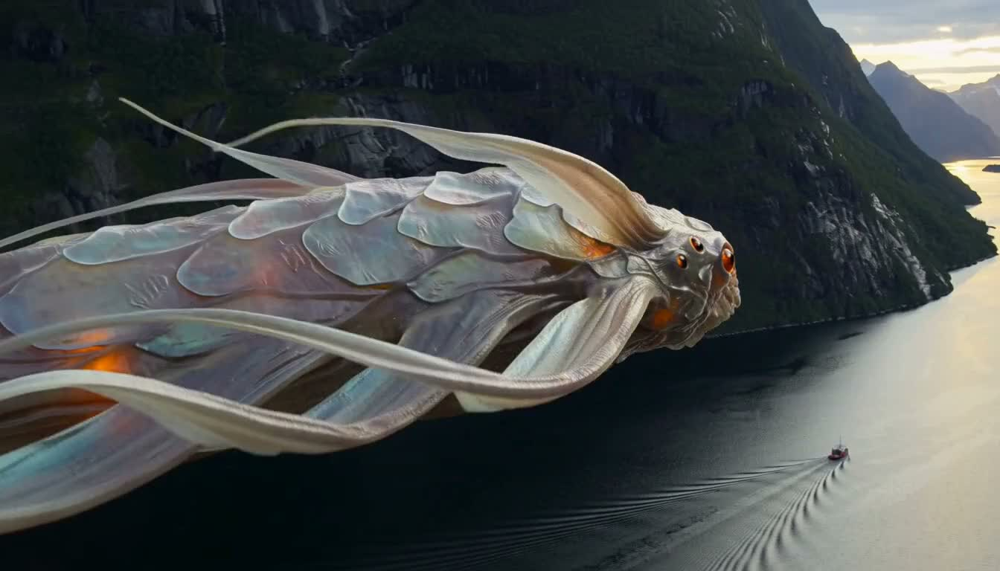
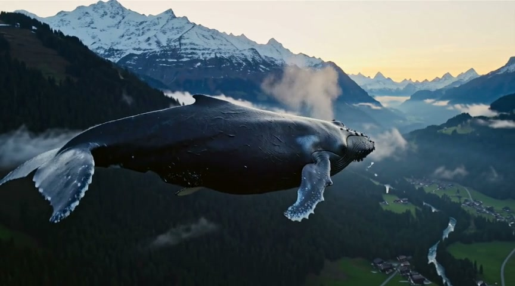
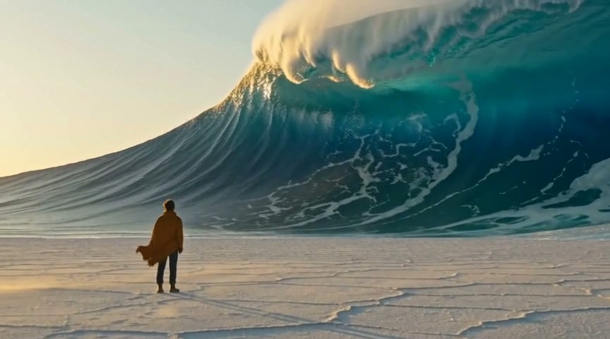
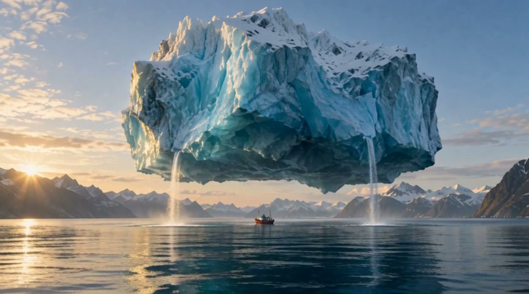

# Surreal scenes, generated locally

Photorealistic landscapes with one impossible event. These clips were generated
with h3-hrx on AMD Strix Halo, using Loom and HRX and the Comfy-Org int8
ConvRot checkpoints. Video, ambient sound, and music are generated by MiniMax H3.
The alien, whale, and desert scenes use text only; the iceberg animates a generated first frame.

Each clip contains 124 frames at 24 fps (5.17 seconds), with 20 evaluations of
`res_multistep`, with no frame interpolation or upscaling. The alien is native
1344×768; the older whale, desert, and iceberg clips are 864×480.
Click a still to open its MP4, or download the file to play it locally.

## Alien fjord · 768p

A colossal creature with pearlescent armor, glowing organs, and long ribbonlike
appendages glides above a Norwegian fjord and a tiny fishing boat.

[](media/benchmarks/20260914/h3-i8.mp4)

[Watch or download](media/benchmarks/20260914/h3-i8.mp4) · [Prompt](prompts/alien_fjord.txt)

```sh
h3 --width 1344 --height 768 --frames 124 --steps 21 --seed 1618 \
  --out alien_fjord.mp4 < docs/prompts/alien_fjord.txt
```

## Alpine whale

A whale glides through clear air above a pine-covered alpine valley at sunrise.

[](media/showcase/alpine_whale.mp4)

[Watch or download](media/showcase/alpine_whale.mp4) · [Prompt](prompts/alpine_whale.txt)

```sh
h3 --width 864 --height 480 --frames 124 --steps 21 --seed 2718 \
  --out alpine_whale.mp4 < docs/prompts/alpine_whale.txt
```

## Desert ocean

A solitary traveler watches a towering turquoise wave curl above a dry salt plain.

[](media/showcase/desert_ocean.mp4)

[Watch or download](media/showcase/desert_ocean.mp4) · [Prompt](prompts/desert_ocean.txt)

```sh
h3 --width 864 --height 480 --frames 124 --steps 21 --seed 31415 \
  --out desert_ocean.mp4 < docs/prompts/desert_ocean.txt
```

## Levitating iceberg

An immense blue iceberg hangs above an Arctic fjord, with waterfalls descending
past a tiny red fishing boat.

[](media/showcase/levitating_iceberg.mp4)

[Watch or download](media/showcase/levitating_iceberg.mp4) · [Video prompt](prompts/levitating_iceberg.txt) ·
[First frame](media/showcase/levitating_iceberg_keyframe.png) · [Image prompt](prompts/levitating_iceberg_keyframe.txt)

This is image-to-video: the first frame was created with the built-in imagegen tool,
then animated with h3. The supplied PNG preserves the exact conditioning image.

```sh
h3 --first-frame docs/media/showcase/levitating_iceberg_keyframe.png \
  --width 864 --height 480 --frames 124 --steps 21 --seed 2026 \
  --out levitating_iceberg.mp4 < docs/prompts/levitating_iceberg.txt
```

## Reproduction

Use the committed prompts verbatim. `--steps 21` specifies 21 sigma grid points,
which produces 20 model evaluations. Output can vary with changes to the model,
attention mode, kernels, compiler, or runtime. The measured configuration and
comparison method are recorded in the [benchmark notes](benchmarks/20260913/README.md).

The original [cliff-rider demo](https://github.com/user-attachments/assets/41a98dcf-48f0-4328-a0f4-7f17119243e6)
uses 1344×768 and 30 evaluations; its prompt and settings are in the
[prompt guide](prompting.md#the-readme-clip).
