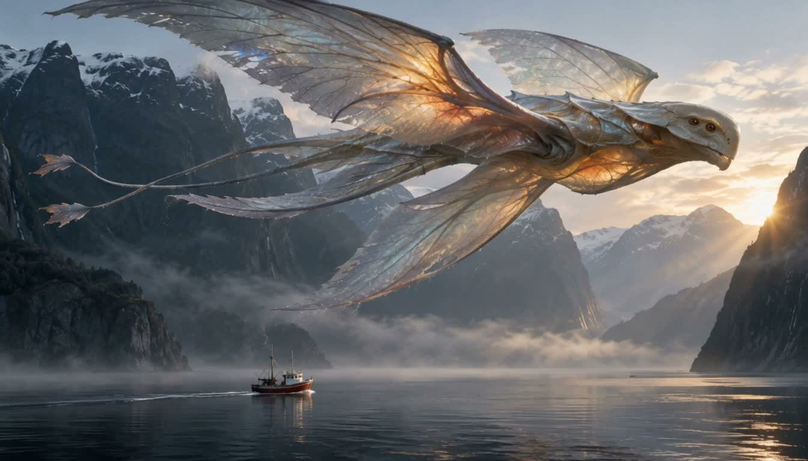
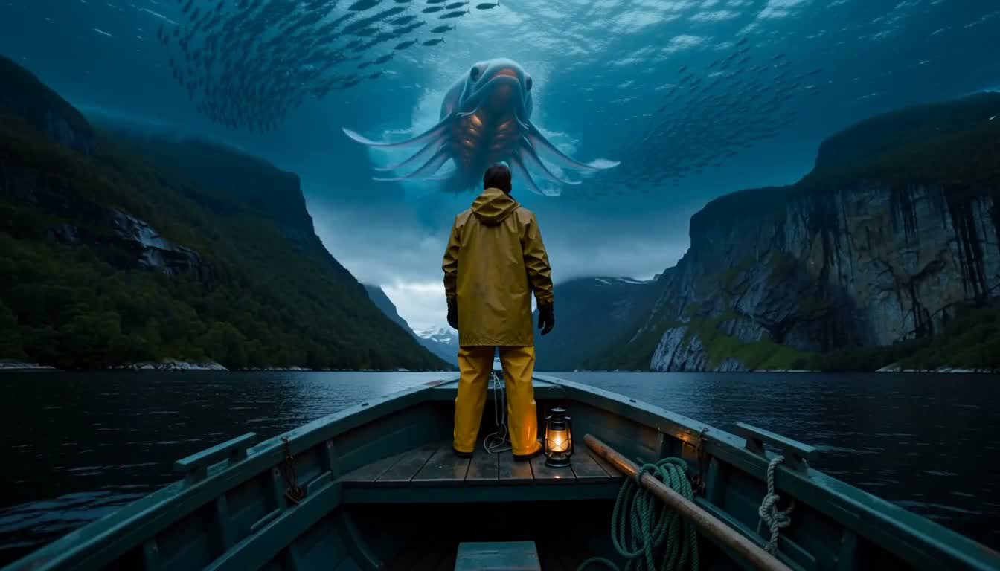
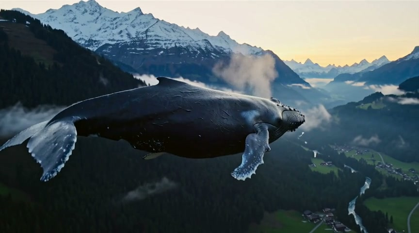
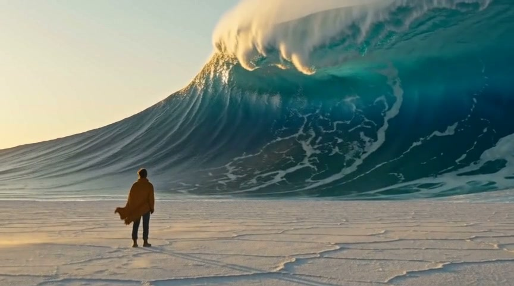
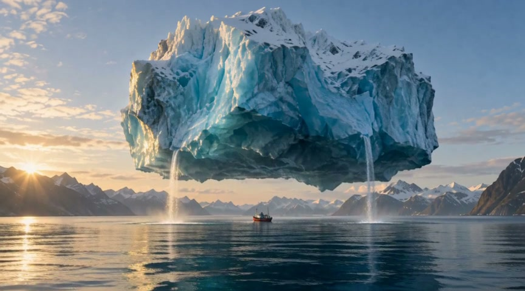

# Videos, timings and prompts

MiniMax H3 renders on AMD Strix Halo through custom Loom kernels and HRX.
Video, ambient sound and music are generated together using the Comfy-Org INT8
ConvRot checkpoints.

Each source clip is 124 frames at 24 fps (5.17 seconds), with 20 ResMultistep
evaluations and no interpolation or upscaling. Commands and prompts are included
below. Click a still to open its MP4.

## Wyvern chase · anime and cinematic

**Native 1344×768 with audio: 31m49s cinematic, 31m57s anime, end to end.**
An archer on horseback evades a diving wyvern along a canyon rim. The
[featured comparison](https://github.com/user-attachments/assets/7a3e95c2-0174-4da4-b2f7-8b7219c650a3)
plays five seconds of anime, then five seconds of cinematic fantasy, with
generated audio from each render.

The [anime prompt](prompts/wyvern_anime.txt) is the unchanged
[000384.txt from Ostris's MiniMax H3 dataset](https://huggingface.co/datasets/ostris/minimax_h3_1k/blob/48a9090db3b88dcf189c9614411f27f80f46b0e3/000384.txt).
The [cinematic prompt](prompts/wyvern_cinematic.txt) replaces only the opening
visual-style clause; the actions, three shots, cut times, soundscape and music
remain unchanged. Both use seed 0, full attention and no step caching.

Measured on Linux, Strix Halo (`gfx1151`), 128 GB unified memory at commit
`a526090`: **31m57.36s** anime and **31m48.84s** cinematic.
These times include weight loading from local
checkpoints, conditioning, denoising, video/audio decoding and encoding.
They exclude checkpoint downloads and the subsequent five-second trims and
concatenation.

```sh
for style in anime cinematic; do
  h3 --width 1344 --height 768 --frames 124 --steps 21 --seed 0 \
    --memory-budget-mib 49152 --residency stage-scoped --weight-io native-direct \
    --storage-slots 4 --storage-slot-mib 16 \
    --out "wyvern_${style}.mp4" < "docs/prompts/wyvern_${style}.txt"
done
```

## Glass Leviathan · 768p

A vast alien with translucent, veined wings glides above a tiny fishing boat in a
Norwegian fjord, its membranes catching the low dawn sunlight.

[](media/showcase/glass-leviathan.mp4)

[Watch or download](media/showcase/glass-leviathan.mp4) · [Video prompt](prompts/glass_leviathan.txt) ·
[First frame](media/showcase/glass_leviathan_keyframe.png) · [Image prompt](prompts/glass_leviathan_keyframe.txt)

This is image-to-video: the first frame was generated with OpenAI's built-in
image-generation tool, then animated locally with h3, which also generated the
sound. The supplied PNG is the untouched conditioning image.

```sh
h3 --first-frame docs/media/showcase/glass_leviathan_keyframe.png \
  --width 1344 --height 768 --frames 124 --steps 21 --seed 2026 \
  --out glass_leviathan.mp4 < docs/prompts/glass_leviathan.txt
```

## Tidal sky · 768p

A fisherman looks up from a wooden boat as an immense, many-finned alien crosses
beneath an ocean suspended between the mountains. Shoals of fish move through
the water overhead, and amber organs glow inside the creature.

[](media/showcase/tidal-sky.mp4)

[Watch or download](media/showcase/tidal-sky.mp4) · [Prompt](prompts/tidal_sky.txt)

```sh
h3 --width 1344 --height 768 --frames 124 --steps 21 --seed 31415 \
  --out tidal_sky.mp4 < docs/prompts/tidal_sky.txt
```

## Alpine whale

A whale glides through clear air above a pine-covered alpine valley at sunrise.

[](media/showcase/alpine_whale.mp4)

[Watch or download](media/showcase/alpine_whale.mp4) · [Prompt](prompts/alpine_whale.txt)

```sh
h3 --width 864 --height 480 --frames 124 --steps 21 --seed 2718 \
  --out alpine_whale.mp4 < docs/prompts/alpine_whale.txt
```

## Desert ocean

A solitary traveler watches a towering turquoise wave curl above a dry salt plain.

[](media/showcase/desert_ocean.mp4)

[Watch or download](media/showcase/desert_ocean.mp4) · [Prompt](prompts/desert_ocean.txt)

```sh
h3 --width 864 --height 480 --frames 124 --steps 21 --seed 31415 \
  --out desert_ocean.mp4 < docs/prompts/desert_ocean.txt
```

## Levitating iceberg

An immense blue iceberg hangs above an Arctic fjord, with waterfalls descending
past a tiny red fishing boat.

[](media/showcase/levitating_iceberg.mp4)

[Watch or download](media/showcase/levitating_iceberg.mp4) · [Video prompt](prompts/levitating_iceberg.txt) ·
[First frame](media/showcase/levitating_iceberg_keyframe.png) · [Image prompt](prompts/levitating_iceberg_keyframe.txt)

This is image-to-video: the first frame was created with the built-in imagegen tool,
then animated with h3. The supplied PNG preserves the exact conditioning image.

```sh
h3 --first-frame docs/media/showcase/levitating_iceberg_keyframe.png \
  --width 864 --height 480 --frames 124 --steps 21 --seed 2026 \
  --out levitating_iceberg.mp4 < docs/prompts/levitating_iceberg.txt
```

## Reproduction

Use the committed prompts verbatim. `--steps 21` specifies 21 sigma grid points,
which produces 20 model evaluations. Output can vary with changes to the model,
attention mode, kernels, compiler and random-number generation.

The original [cliff-rider demo](https://github.com/user-attachments/assets/41a98dcf-48f0-4328-a0f4-7f17119243e6)
uses 1344×768 and 30 evaluations; its prompt and settings are in the
[prompt guide](prompting.md#cliff-rider-example).
